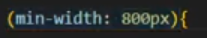

Aprendendo MEDIA QUERY

Os tipos de media definem a ampla categoria de dispostivo para a qual a consulta de midia se aplica:
All, Print, screen, o tipo é opcional, ocalor padrao conssiderado é o ALL, exceto ao usar os operadores logicos not ou only

Os recursos de media descrevem uma caracterisitca especifica do agente do usuario, dispositivo de saida ou ambiente. ex.max-width

exemplo: 

@media only screen and(max-widht:600px){
    body{
        background-color: red
    }
}

Ás vezes, pode ser necessario criar uma media query que depende de variass condiçoes. para isso tambem temos os operadores logicos: not, and, e only.

Alem disso, voce pode combianr variass media queries em uma lista sseprada por virgulas; isso permite que voce aplique os messmo estilos em diferentes situiaçoes.

exemplo:
@media prin{            
    /*...*/
}

@media (hover:hover){
      /*...*/
}`

@media (Min-widht: 30em) and (orientatio: landsape{
      /*...*/
   
})

 -> quando usamos a virgula no parametro quer dizer que é uma outra requiciçaõ totalmente difente das passadas anteriomente 

exemplo 

@media(max-height:782px) and (max-widht:600px), (min-widht:800px)

nesse exemplo o parametro passado depois da virgula (min-widht:800px), ele sai totalmente da regra passa no and '(max-height:782px) and (max-widht:600px)'
se tornando basicamente um "ou"

MEDIA QUERY L4 (ANGUNS NAVEGAROES AINDA NAO SUPORTA ESSE TIPO DE MEDIA QUERY)

Media query level 4 inclui algumas melhorias de sintaxe usando recursos que tem um tipo de "itervalo", por exemplo, width ou height, menos detalhados.

exemplos:

@media (max-width:30em){
    /*...*/
}

@media(width <= 30em){
    /*...*/
}

@media(min-widtht:30em) and (max-width:50em){
    /*...*/
}

@media (30em <= width <= 50em)
